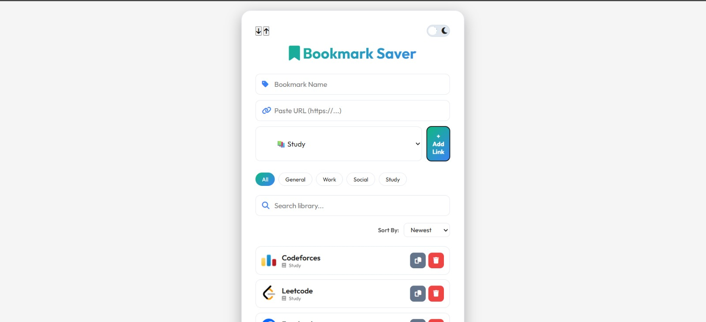
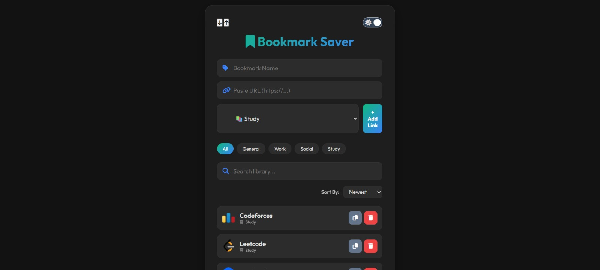

# Bookmark Saver 🔖

A professional, layered-charcoal bookmark manager featuring smart favicon fallbacks, dynamic category filtering, and a strict A-Z organization system. 

[🔗 View Live Demo](https://front-end-projects-bookmark-saver.vercel.app/)

## 🖥️ Preview

  
  

## ✨ Features
* **Smart Categorization**: Organize links into **General**, **Work**, **Social**, or **Study** categories.
* **Dynamic Filtering**: Instant view switching using interactive category pills.
* **Advanced Sorting**: Strict A-Z sorting logic, plus Newest and Oldest viewing options.
* **Favicon Failover**: Automatically fetches site icons via DuckDuckGo API with a stylized gradient letter fallback for missing icons.
* **Theme Engine**: Seamless Light/Dark mode toggle with a custom Charcoal/Grey palette tuned for modern displays.
* **Data Portability**: Built-in JSON Export and Import functionality for manual local backups.
* **Utility Tools**: One-click copy to clipboard and secure deletion with confirmation pop-ups.

## 🛠️ Technical Stack
* **HTML5/CSS3**: Semantic structure and modern Flexbox/Grid layout using CSS Custom Properties.
* **JavaScript**: Vanilla ES6+ logic utilizing LocalStorage and the Clipboard API.
* **Typography**: Outfit (Geometric Sans Serif) from Google Fonts.
* **Icons**: Font Awesome 6.4.0.

## 🚀 How to Use
1. **Add a Link**: Enter the name and URL of your favorite site in the input fields.
2. **Categorize**: Select a category from the dropdown menu.
3. **Save**: Click "+ Add Link" to store it in your browser's local storage.
4. **Manage**: Use the search bar, category pills, or sorting dropdown to organize your library.
5. **Backup**: Use the export button (down arrow) to save your data as a `.json` file.
