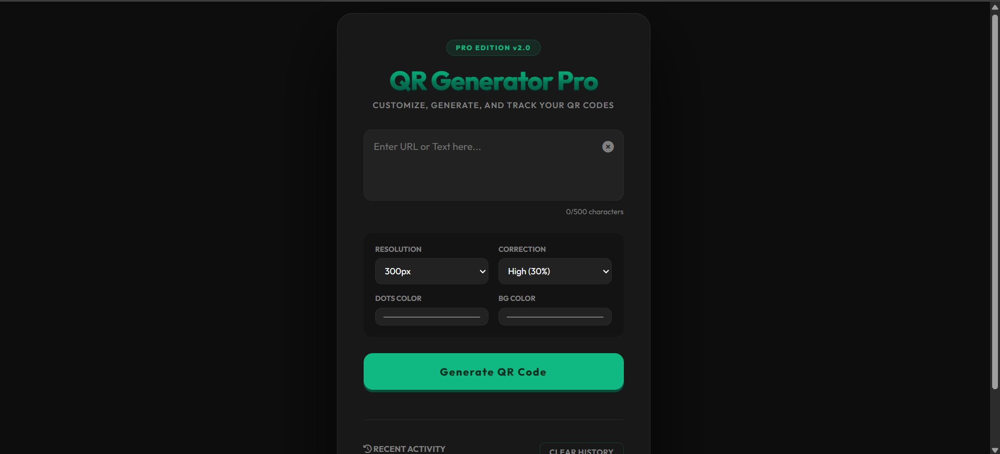

# QR Generator Pro | Elite Dashboard Suite 💎

## 🔗 [LIVE PROJECT LINK](https://front-end-projects-qr-generator-pro.vercel.app/)
[](https://github.com/anweshathapa)

## 🖥️ Project Preview


A professional-grade, dashboard-style utility designed for high-precision QR asset generation.

---

## 🚀 Architectural Overview

Unlike standard single-page forms, **QR Generator Pro** utilizes a dual-pane dashboard layout:
* **The Control Sidebar**: Houses the input engine, metallic 3D heading, and mechanical "Matte-Press" controls.
* **The Preview Stage**: A dedicated canvas featuring a "Midnight Shimmer" transition that handles asset rendering and exports.

## 🌟 Key Features

* **3D Metallic Engine**: Advanced CSS `linear-gradient` and `drop-shadow` filters create a physical, tactile heading and button system.
* **High-Resolution Assets**: Custom scaling from **100px** to **400px** with variable error correction (up to 30% precision).
* **Midnight Shimmer State**: A sophisticated "Beautiful Black" skeleton loader provides professional feedback during the encoding process, preventing UI flicker.
* **Persistence Layer**: Integrated `localStorage` engine that mirrors a Bookmark Saver's ability to track and re-call recent data instantly.
* **Responsive Grid Suite**: A mobile-optimized layout that stacks components intelligently on smaller viewports to prevent UI overflow.

## 🛠️ Technical Implementation

### UI/UX Design
* **Typography**: *Outfit* (Geometric Sans-Serif) tightened with negative letter-spacing for a premium brand feel.
* **Interactions**: Uses `cubic-bezier(0.4, 0, 0.2, 1)` for non-linear, organic feeling transitions.
* **Micro-copy**: Terms like "Asset Generation" and "Resolution" are used to maintain a professional software persona.

### Technology Stack
* **Logic**: JavaScript (ES6+) History Engine.
* **Styles**: Custom CSS3 Variables & Dashboard Grid.
* **QR Core**: [QRCode.js](https://davidshimjs.github.io/qrcodejs/) for client-side encoding.

### 💡 Technical Note: Client-Side Encoding
By utilizing `QRCode.js`, this application performs all data encoding directly in the user's browser. 
* **Privacy**: Data never leaves the client’s machine.
* **Speed**: Zero server latency for asset generation.
* **Efficiency**: Reduces server load by offloading computation to the client.


## 📂 Repository Structure

```text
QR-Generator-Pro/
├── index.html       # Semantic Dashboard Structure
├── style.css        # 3D Elements, Glassmorphism, & Shimmer Shaders
└── script.js        # History Logic, Toast Manager, & QR Rendering
